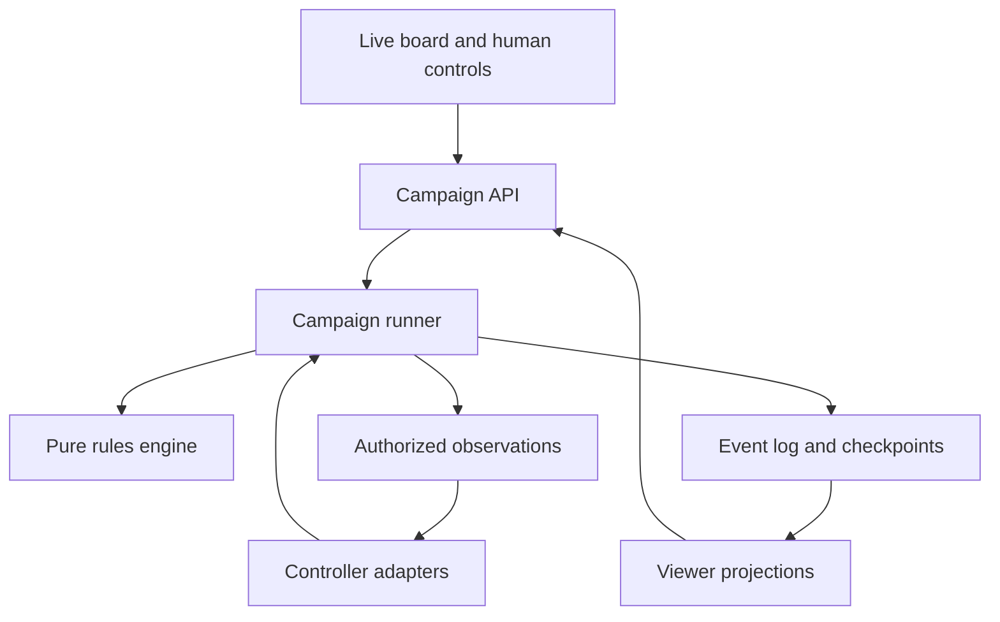

> **Historical document.** This is the project owner's original design (v0.1, 6 October 2026), kept
> as the starting point. Where it conflicts with [`decisions.md`](decisions.md) — notably the
> technology stack (now Rust + React/PixiJS), the first scenario's scope, and milestone order —
> the decision log wins. One unrelated sentence about a personal assistant integration was removed.

# The Campaign for North Africa — Digital Game Design

**Working title:** CNA Digital  
**Document version:** 0.1  
**Date:** 6 October 2026  
**Status:** Proposed product requirements and technical design; implementation has not begun.  
**Audience:** Project owner, game/rules developers, interface developers, and AI integration developers.

## 1. Purpose

Create a digital adaptation of *The Campaign for North Africa* that preserves meaningful player decisions while automating rule enforcement and accounting. The game must support fully automated AI campaigns, mixed human/AI teams, and human-only play through the same simulation.

Each command seat must independently accept a conventional LLM, a fast System 1 decision model such as Jev, or a human player. A live visual board must make the campaign understandable while it runs. Players must be replaceable during a campaign without losing the game state.

The intended result is both a playable strategy game and an experimental environment for comparing decision-making systems. Completing games quickly is desirable; strategic competence, rule fidelity, and inspection of results remain separate requirements.

### 1.1 Confirmed requirements

| ID | Requirement | Completion evidence |
| --- | --- | --- |
| USER-01 | Digitally recreate the board game, with the full campaign as the eventual target. | A complete campaign can reach a valid conclusion under a declared rules profile. |
| USER-02 | Support AI decision-makers, including fast System 1 models. | Both a conventional LLM and a System 1 adapter complete supported scenarios. |
| USER-03 | Identify and expose player choices separately from automatic bookkeeping. | A reviewed decision catalogue maps implemented rule cases to input requests or automatic transitions. |
| USER-04 | Provide a visual representation of the board that updates live. | A spectator can observe a running campaign and inspect its current board. |
| USER-05 | Allow any player seat to be human, LLM, or System 1 controlled. | All ten default command seats accept any controller type independently. |
| USER-06 | Allow controllers to be swapped during play. | A pending seat decision survives a controller handover without duplicate or lost orders. |
| USER-07 | Investigate previous digitization efforts. | Existing projects are documented, with verified capabilities distinguished from claims and plans. |

### 1.2 Language of requirements

- **MUST** indicates an acceptance requirement for the relevant release scope.
- **SHOULD** indicates the proposed default, changeable with a recorded rationale.
- **MAY** indicates an optional feature.
- **Rules-derived** identifies behavior that must be confirmed against the selected game sources.
- **Design proposal** identifies software behavior introduced by this document.

“Full design” here means a complete product and architecture overview. It does not mean the original rulebooks, tables, scenarios, and errata have already been converted into an exhaustive executable specification.

## 2. Scope and fidelity

### 2.1 Target game

The baseline target is the original SPI game, with the Land, Air, and Logistics systems and an explicitly selected errata set. The full campaign is described as 111 weekly turns. The rules recommend dividing team responsibilities among overall command, logistics, rear areas, air, and front-line operations. [S1][S2]

The final product MUST preserve the original game’s meaningful choices, information restrictions, sequencing, costs, and outcomes within its declared profile. It must not silently substitute modern military doctrine or historical realism for the published mechanics.

### 2.2 Rules profiles

Every campaign MUST pin:

```text
rules_profile_id
rules_profile_version
rules_source_manifest_hash
scenario_id
scenario_data_hash
engine_version
random_algorithm_version
interpretation_set_id
information_profile_id
assistance_profile_id
```

Different levels of implemented coverage must be explicit. A Land-only release is a staged delivery milestone, not fulfillment of the full-game target. Experimental house rules must be labeled as variants and must not be mixed into the faithful baseline.

An unresolved rule interaction MUST produce a development-time failure or an explicit unsupported-case stop. A language model must never invent an adjudication in order to keep a supposedly faithful game moving.

### 2.3 Included in the target product

- Complete supported scenarios and eventually the full campaign.
- Ten default command seats: five per side.
- Any mixture of human, conventional LLM, and System 1 controllers.
- One controller serving multiple seats, including one per side.
- A live map, human order entry, team coordination, replay, and inspection.
- Headless execution for automated campaigns and evaluation.
- Durable saves, crash recovery, reproducible accepted-order replay, and campaign export.
- Configurable compute, cost, and time limits for AI controllers.

### 2.4 Deferred or excluded from the initial implementation

- Photorealistic or three-dimensional rendering.
- An RTS redesign with continuous simulated time.
- Reinforcement-learning training infrastructure or a new foundation model.
- Guaranteed expert-level AI play.
- Automatic interpretation of the rulebook during live play.
- Physical camera recognition of a tabletop board. A “human player” means a person operating the digital interface.
- Integration with external companion agents unless a concrete interface is later specified.

## 3. Player decisions and ownership

### 3.1 Ownership policy

The role boundaries are a practical team organization, not five separate games. The following is a proposed ownership map. It must be configurable so a team can redistribute responsibility without changing legal game actions.

Every actionable entity or decision domain MUST have exactly one current decision owner. Shared-resource disputes go to the commander or another configured arbiter. Subordinates may propose resource use; proposals do not reserve or consume resources until accepted by the authoritative command path.

### 3.2 Rules-derived decision inventory

This compact inventory identifies choice families, not all their legal parameter ranges. A full implementation must attach individual rule cases, timing, disclosure, and exceptions to each family.

| Proposed owner | Decision families |
| --- | --- |
| Commander | Strategy, intelligence priorities, disputes; initiative-holder’s first/second choice; special operations and Rommel deployment. |
| Front line | Unit routes, movement order, stopping, breaking off; reactions; reserves and release; gun/armor positioning; barrage targets; assault forces, probes, withheld forces, anti-armor/assault assignments; combat order and continuation; retreat choices; discretionary losses; patrols; surrender. |
| Rear area | Attachments, detachments, formations, replacements, rebuilding, training, upgrades, withdrawals; engineering sites and assignments; construction, demolition, mines, fortifications, roads, railways, airfields, repair facilities, dumps; recovery, towing, repair attempts; prisoner guards and movement. |
| Assigned naval owner | Commonwealth fleet deployment, bombardment, transport, repairs; eligible special naval actions. |

These families correspond primarily to Land rules §§7–31; eligibility differs by situation. [S2]

| Proposed owner | Decision families |
| --- | --- |
| Logistics | Axis convoy cargo, lanes, ports; supply recipients and quantities; truck assignments, loads, routes; dumps; coastal and rail shipments; fuel transfers; cargo recovery; abandonment or destruction; water collection, delivery, pipelines; well and harbor work requests. |
| Air | Strategic/land-support allocation; Malta and convoy missions; aircraft, pilots, targets, paths, escorts; bombing, strafing, patrols, reconnaissance, transport, transfers, mining; interception and scramble; optional engagement; aircraft matchups; permitted attack ordering; aborts; refueling, rearming, refitting; basing and support transfers; emergency flight and fuel-tank choices. |

These families correspond primarily to Air/Logistics rules §§34–56. [S3]

### 3.3 When decisions happen

The weekly structure includes strategic preparations and three operations stages. Movement/combat cycles can repeat within a stage, and reactions interrupt ordinary action flow. [S3]

The software MUST implement the exact phase sequence as a rules-profile state machine. The list above is grouped by ownership for interface design; it is not permission to perform every listed action once per turn or in arbitrary order.

Decision requests fall into three software categories:

| Category | Meaning | Controller behavior |
| --- | --- | --- |
| Standing policy | A persistent preference or objective introduced by the software. | Revise when desired; otherwise retain it. |
| Scheduled decision | A legal choice at a specified game phase. | Submit an order or an explicitly legal pass. |
| Triggered decision | A new choice caused by movement, combat, discovery, or another event. | Resolve before the suspended operation continues. |

The engine SHOULD avoid prompting when only one legal result exists. It MUST NOT treat a common or strategically obvious choice as forced.

### 3.4 Command-level plans

The commander’s software interface SHOULD support a structured plan containing objectives, assigned forces, resource priorities, reserve expectations, and approval conditions. These are coordination aids, not new combat modifiers.

For example, an objective might state: “Protect the eastern supply route; requests to consume the strategic fuel reserve require approval.” The engine enforces who can authorize that budget in the selected team workflow. It does not alter the underlying game cost or combat result.

Team coordination MUST distinguish:

1. A proposal that asks for authority or resources.
2. An approved allocation or delegation.
3. An executable game order.
4. The engine’s acceptance and resulting effects.

### 3.5 Automation boundary

| Engine responsibility | Player or delegated controller responsibility |
| --- | --- |
| Calculate an order’s legal costs. | Choose whether the order is worthwhile. |
| Apply mandated consumption and losses. | Choose among permitted recipients or loss allocations. |
| Determine legal options and timing. | Select an option and its parameters. |
| Resolve randomized outcomes. | Decide whether to incur the risk. |
| Track inventories, state, schedules, and consequences. | Set priorities when resources or opportunities compete. |
| Maintain an exact history. | Revise objectives in response to events. |

A standing order may automate a player choice only through explicit delegation. Such actions must be logged as policy-selected orders, not presented as forced rules effects. The same delegation facility SHOULD be available to humans and both AI types.

### 3.6 Decision catalogue completion gate

Before a subsystem is declared complete, every relevant rule case MUST have a disposition:

- Automatic transition.
- Player decision with an identified owner and decision schema.
- Scenario/data constraint.
- Display or information-disclosure requirement.
- Superseded by identified errata.
- Explicit unresolved interpretation or unsupported case.

For each player decision, record prerequisites, legal domains, timing, affected resources, secrecy, interrupt behavior, cancellation rules, and test fixtures. A subsystem is not complete while applicable cases remain unclassified.

## 4. Shared controller contract

### 4.1 Controller types

| Type | Input | Output | Requirements |
| --- | --- | --- | --- |
| Human | Map, panels, legal options, situation report. | Structured order through UI. | No rule calculations or bookkeeping required. |
| Conventional LLM | Authorized structured observation, instructions, tools. | Schema-validated tool call/order. | No authority to mutate state directly. |
| System 1 | Authorized state summary and typed candidate questions. | Choices, scores, or probabilities. | Adapter converts answers to the same structured order format. |
| Scripted baseline | Same observation and action contract. | Deterministic or seeded policy action. | Used for integration and evaluation. |

Jev is an example provider, not a required dependency. Provider-specific limits belong in an adapter capability record. TypeSafe describes typed probabilistic decisions and parallel outputs; game-specific strategic competence remains unestablished. [S7]

### 4.2 Decision request

The following is a proposed software schema. Identifiers and example actions are illustrative rather than an official rule transcription.

```ts
type ControllerKind = "human" | "llm" | "system1" | "scripted";

interface DecisionRequest {
  schemaVersion: string;
  campaignId: string;
  decisionId: string;
  seatId: string;
  controllerEpoch: number;
  decisionRevision: number;
  observationToken: string;
  phase: { turn: number; stage: string; step: string };
  decisionKind: string;
  observation: AuthorizedObservation;
  actionSpace: ActionSpaceDescriptor;
  standingOrders: StandingOrder[];
  teamMessages: TeamMessage[];
  budget: { maxCalls?: number; deadlineUtc?: string };
}

interface DecisionResponse {
  schemaVersion: string;
  campaignId: string;
  decisionId: string;
  seatId: string;
  controllerEpoch: number;
  decisionRevision: number;
  observationToken: string;
  idempotencyKey: string;
  action: GameCommand;
  publicExplanation?: string;
}
```

`observationToken` MUST be opaque. It must not encode a hash of hidden game state that players could use to infer hidden changes. The engine privately tracks the authoritative dependencies of each decision. Public revision changes must not reveal unrelated secret activity.

### 4.3 Action-space representation

The engine MUST support parameterized actions rather than enumerate every possible joint order. An action descriptor may provide entity selectors, coordinate domains, quantity bounds, compatibility constraints, and a validation endpoint.

Large decisions SHOULD be decomposable into legal subdecisions. Candidate generation may suggest routes, assignments, or allocations, but the faithful interface must preserve access to the complete legal space through parameter entry or hierarchical selection. A small preselected menu must not silently become the game’s entire action space.

Candidates derived using hidden information must never reach a player. Even the presence, ranking, validation error, or absence of a candidate can reveal information; candidate generation and validation require the same disclosure review as ordinary observations.

### 4.4 Assistance profiles

All controller types SHOULD have access to equivalent engine-derived facts: legal costs, known terrain, visible inventories, and relevant rules explanations. Optional planning assistance must be declared separately:

| Profile | Assistance |
| --- | --- |
| Mechanical | Legal validation and deterministic immediate costs only. |
| Analytical | Authorized forecasts and resource projections. |
| Planning | Candidate plans, optimization, or simulation rollouts. |

A route-cost calculation is a mechanical aid. Selecting the best route under a strategic objective is a policy decision. Match reports must state which assistance profile each seat used.

### 4.5 LLM adapter

The LLM adapter MUST:

- Construct observations from the authorized projection, not the full world state.
- Offer structured inspection and command tools.
- Keep its prompt version and model configuration in the run metadata.
- Limit tool calls, retries, tokens, elapsed time, and spend according to campaign settings.
- Preserve durable plans and factual notes outside transient conversation context.
- Treat prose explanations as optional commentary, not executable orders.

The game must not require private reasoning traces. A model may provide a short player-visible reason or structured intent if supported.

### 4.6 System 1 adapter

The System 1 adapter MUST present bounded questions and convert selected values into ordinary commands. It SHOULD batch independent questions sharing an observation.

If a provider cannot handle the full choice cardinality, use a declared hierarchy or paging strategy. If filtering changes the available strategies, record that as assistance or policy behavior. Numerical calculations and legality remain in code.

Model confidence is not automatically a calibrated chance of victory. It MUST NOT be displayed as such. Optional escalation to a conventional LLM is a separate hybrid controller mode, disabled in experiments intended to measure pure System 1 play.

### 4.7 Human adapter

Human players MUST be able to make all supported decisions without writing JSON. Map selection, overlays, forms, quantity controls, legal targets, and order previews must cover the same action space available to AI controllers.

The interface SHOULD present decisions in context, preserve unfinished drafts, and distinguish draft orders from committed orders. Local hot-seat and remote-human play are different connection modes for the same controller contract.

### 4.8 Failure and budget behavior

Timeouts, invalid answers, provider outages, and exhausted budgets MUST NOT silently become passes, retreats, or surrenders. The default is to pause the affected decision and offer retry or takeover. A campaign may explicitly configure a fallback controller or standing policy; its activation must be recorded.

Repeated invalid proposals must not mutate state or advance randomness. Errors should be actionable without revealing hidden facts.

## 5. Seats, teams, and controller handover

### 5.1 Seat configuration

The default lobby contains five roles on each side. Each seat has a controller type, controller configuration, asset/domain ownership, and a durable role notebook. Multiple seats may be assigned to one human or one AI process without merging their permissions implicitly.

Example configuration:

| Role | Axis | Commonwealth |
| --- | --- | --- |
| Commander | Human | Conventional LLM |
| Logistics | System 1 | System 1 |
| Rear area | Conventional LLM | Human |
| Air | System 1 | Conventional LLM |
| Front line | Human | System 1 |

An AI controlling several roles still receives role-scoped requests unless the campaign explicitly grants side-wide access. A team information-sharing variant may restrict communications, but the faithful baseline must first follow the board game’s actual disclosure rules.

### 5.2 Handover protocol

1. Request a controller change for a seat.
2. Pause at the next safe decision boundary; finish any already accepted atomic order.
3. Increment the seat’s `controllerEpoch` and invalidate outstanding controller leases.
4. Cancel unfinished external requests where possible; reject late responses regardless.
5. Retain accepted orders and any still-secret committed submissions.
6. Transfer the seat’s authorized observation, durable notes, objectives, and pending decision.
7. Reissue unfinished work to the new controller with a fresh lease.
8. Log the handover and resume.

The old controller must never complete an action after its replacement has authority. Handover does not rewind the game, erase a commitment, reveal the opponent’s orders, or reset the compute accounting.

A human who previously viewed omniscient information may take over in a casual game, but that run must be marked as privileged-information-assisted. Ranked or controlled experiments should prohibit such takeover.

### 5.3 Team coordination

A structured message board SHOULD support requests, proposals, approvals, objectives, and status updates. Messages must be scoped to their intended recipients and preserved in the campaign history.

System 1 controllers should communicate through typed messages such as `request_resource`, `propose_objective`, and `report_constraint`; natural-language generation must not be required. Human and LLM controllers may add text alongside those fields.

## 6. Authoritative rules engine

### 6.1 State transition model

Use a pure core with the conceptual boundary:

```text
evaluate(state, command, rules, random_state)
    -> accepted transition + events + pending decisions
    -> or rejection with no mutation
```

The core owns legality, costs, timing, random draws, outcomes, and state invariants. Network access, model inference, rendering, and user interaction remain outside it.

The runner executes automatic transitions until a legal decision window opens or the game ends. Commands are accepted only through the runner’s authoritative serialization point.

### 6.2 Automatic work

The engine MUST execute all implemented calculations and mandatory bookkeeping: inventory adjustments, movement costs, table resolution, scheduled effects, status changes, and victory checks. It must use the exact arithmetic and rounding specified by the rules profile.

Strategic optimization is not automatic bookkeeping. Where a rule leaves a material choice, the runner must request an order or invoke an explicitly authorized standing policy.

### 6.3 Decision windows and interruptions

Represent a decision window explicitly:

```text
window_id
eligible_seats
required_decisions
visibility_policy
dependencies
resource_conflicts
submission_status
resolution_condition
continuation
```

A long move or other multi-step order must be interruptible at legal reaction points. On interruption, the engine stores a continuation and resolves the intervening decision before continuing. It must revalidate remaining steps when their prerequisites change.

Batch submissions must declare execution semantics: atomic selection, ordered sequence, or independent actions. An adapter cannot choose semantics that bypass required timing or reactions.

### 6.4 Simultaneous and secret choices

Where the selected rules require simultaneous hidden submissions, the trusted server stores choices privately and reveals or resolves them only when the window’s condition is met. No cryptographic protocol is necessary for the initial trusted-server model.

Partial submission status and timing should not disclose more than the information profile permits. A controller change must not allow retraction or revision after a commitment is final.

### 6.5 Concurrency

One authoritative writer per campaign SHOULD serialize accepted state changes. AI calls may run concurrently only where observations and decisions are genuinely independent or where the rules define a simultaneous window.

Do not parallelize arbitrary unit orders merely because they belong to different seats. Shared supplies, stacking, movement sequencing, and reactions can create dependencies. For planning windows, the runner should use read/write dependencies and explicit resource reservations rather than “last write wins.”

### 6.6 Determinism

- Use a specified seeded random generator and version its draw semantics.
- Keep random draws inside accepted transitions.
- Persist the random state in checkpoints and record draws or resolved random outcomes in events.
- Use stable ordering and integer or rational/fixed-point arithmetic where required.
- Avoid wall-clock-dependent rules and unordered collection iteration.
- Make replays independent of live provider calls.

Replay of accepted commands and recorded randomness must be reproducible. Rerunning an AI from the same initial position is a different operation and may yield different choices even when configured similarly.

## 7. Data and content model

### 7.1 Principal records

| Record | Contents |
| --- | --- |
| Campaign | Version pins, lifecycle, turn/phase, policies, current revision. |
| Map | Hexes, terrain, edges, connections, facilities, off-map areas. |
| Formation | Stable identity, hierarchy, location, attachments, status. |
| Strength/equipment | Quantities, classes, capabilities, current condition. |
| Supply inventory | Resource quantities, location, carrier, ownership. |
| Transport/order | Carrier assignments, cargo, route, progress, commitments. |
| Air assets | Aircraft, pilots, support associations, readiness, missions. |
| Work project | Site, work type, assigned assets, progress, remaining prerequisites. |
| Schedule | Scenario arrivals, departures, and other dated effects. |
| Knowledge | What a side knows, source, observation time, uncertainty. |
| Decision | Window, owner, action domain, commitment, resolution status. |
| Controller binding | Seat, provider/type, version/configuration, epoch, budgets. |
| Event/checkpoint | Ordered history and restartable snapshots. |

All quantities MUST specify units. Display names must never serve as database identity. Historical data and rules logic should be separate packages with content hashes.

### 7.2 Content pipeline

1. Acquire the selected rules, errata, map, tables, counters, and scenario materials.
2. Extract structured data; retain source references for each imported record.
3. Manually review ambiguous OCR, map coordinates, tables, and exceptions.
4. Validate cross-references, totals, enum values, and scenario prerequisites.
5. Publish a versioned content package.
6. Bind every new campaign to a specific package.

Generated or inferred historical values must not be substituted silently for missing source data. Missing records block a claim of complete fidelity.

### 7.3 Interpretations register

Each ambiguity record MUST include source case identifiers, conflicting evidence, the chosen interpretation, its rationale, affected behavior, reviewer, tests, and the version in which it applies. Changing an interpretation creates a new profile version; it must not silently rewrite an active campaign.

## 8. Information and visibility

Maintain three distinct representations:

1. **Authoritative world:** full simulation truth, accessible only to adjudication and authorized administration.
2. **Player observation:** the state legitimately visible to a seat under the selected profile.
3. **Viewer projection:** a player perspective, a delayed spectator perspective, or an explicitly authorized omniscient view.

Do not invent fog-of-war rules simply because they are common in computer wargames. The baseline must implement the original game’s actual concealment and disclosure; alternative visibility systems are named variants.

Server-side projections MUST filter snapshots, event streams, tool responses, logs, exports, and narratives before they reach a player. Hiding elements in the browser is insufficient.

An AI agent’s summary must use the same permitted knowledge as its detailed queries. Predictions must be labeled as estimates, and stale observations must retain their observation time. No model-generated guess becomes an authoritative discovered fact.

The omniscient view should use a separate endpoint/authorization path. Privileged snapshots must not be reused as the input to a seat’s agent.

## 9. Live board and human interface

### 9.1 Board requirements

The viewer MUST show the actual campaign state as it changes. It must work for a human player, a passive spectator, or an operator inspecting an automated run.

| Feature | Requirement |
| --- | --- |
| Navigation | Pan, zoom, minimap, search, and jump to selected asset or event. |
| Representation | Readable hexes, terrain, facilities, unit stacks, and faction identifiers. |
| Detail | Select a formation and inspect its permitted composition, supplies, and status. |
| Orders | Preview and distinguish drafts, committed orders, execution, and cancellation. |
| Overlays | Toggle supply, transport, air missions, projects, combat, and known control/information. |
| Event feed | Click an event to focus the map and inspect its effects. |
| Playback | Pause viewing, step, scrub history, change playback speed, return to live. |
| Perspectives | Switch among authorized player and spectator views. |
| Seats | Inspect controller assignments, pending decisions, failures, and handover controls. |

### 9.2 Proposed layout

- Central board occupying most of the screen.
- Top bar showing scenario, simulated date, turn, phase, and run status.
- Collapsible left panel for formations and seat ownership.
- Right inspector for the selected unit, project, mission, or decision.
- Bottom timeline and filtered event feed.
- Overlay controls for the relevant resource or operational layer.

Use shape, iconography, and text as well as color. Dense stacks must remain selectable. Keyboard navigation should cover common inspection and order-entry actions.

### 9.3 “Live” versus simulated time

The game remains turn-based. Live means the board updates when the engine accepts orders and resolves effects.

Simulation speed and animation speed MUST be independent. A fast automated run should continue without waiting for visual movement to finish. The viewer may aggregate routine events while preserving complete details in the log.

Provide two distinct controls:

- **Pause playback:** inspect history while the campaign may continue.
- **Pause campaign:** stop adjudication at a safe boundary, subject to operator permissions.

The interface must visibly distinguish historical playback from current state. Orders cannot be submitted into a historical frame. “Branch from here” creates a new campaign and identifier; it never alters live history.

### 9.4 Stream and reconnect behavior

Late subscribers receive an authorized snapshot at event sequence N, followed by events after N. Streams require sequence numbers, gap detection, bounded buffering, and resynchronization.

The server MUST preserve complete events even if a client falls behind. A slow spectator must not block the campaign. The client may skip animation and refresh from a newer snapshot.

### 9.5 Performance goals

These are initial engineering targets, not measured claims:

- Smooth map navigation on an ordinary desktop at the reference scenario size.
- Routine inspector interactions should feel immediate from cached authorized data.
- Normal local state changes should appear within approximately one second, excluding provider inference.
- No animation dependency in headless throughput.

Define the reference hardware, entity counts, and active overlays before treating frame-rate or latency numbers as release gates. Profile the full campaign before choosing a rendering rewrite.

## 10. Architecture and proposed technology

### 10.1 Component relationships



The human interface and AI adapters converge on the same command boundary. The viewer receives projections of committed state, not a separate approximation of the simulation.

### 10.2 Recommended starting stack

This is a design recommendation, not a dependency on a specific existing project:

| Area | Proposed starting choice | Reason |
| --- | --- | --- |
| Rules core and contracts | TypeScript, with explicit numeric bounds and pure modules. | Shared types with the web client and a short prototype path. |
| Runner/API | Node.js service. | Keeps orchestration close to the core. |
| Initial persistence | SQLite with transactional event/checkpoint writes. | Simple local deployment and portable campaigns. |
| Multi-user persistence | PostgreSQL when hosting requirements justify it. | Centralized durability and concurrent campaign management. |
| Interface | React and a Canvas 2D map. | Readable controls with efficient dense map drawing. |
| Live transport | WebSocket or SSE plus ordinary command requests. | Ordered updates without polling the whole state. |
| AI integration | Provider adapters behind the controller contract. | Enables replacements without modifying the rules. |
| Packaging | Local executable/service scripts and optional container deployment. | Supports both developer and self-hosted use. |

A C#/.NET implementation is also reasonable if adopting a reviewed existing engine. Rust is a possible later core implementation if profiling reveals a concrete performance need. The first milestone should not require multiple implementation languages or distributed infrastructure.

### 10.3 Persistence transaction

An accepted order, emitted events, updated pending decisions, random state, and associated authoritative revision MUST be durably committed together. A client acknowledgement is sent only after that commit succeeds.

Persist enough information to retry delivery without replaying an accepted command. Idempotency keys and uniqueness constraints must prevent duplicate execution after reconnects or provider retries.

### 10.4 Boundaries and deployment

Start with one local campaign service and one web client. Multiple campaigns may later run in separate workers, each with one logical authoritative writer. Distributed model workers are optional; they acquire decision leases and return responses without owning campaign state.

Remote human play requires authentication, explicit seat assignment, role-based permissions, and reconnect support. Provider keys remain server-side and are excluded from exports and ordinary logs. Campaign operators may manage seats without automatically granting players omniscient game information.

## 11. API outline

These endpoints describe responsibilities, not a finalized wire protocol:

| Operation | Purpose |
| --- | --- |
| Create campaign | Validate scenario/profile compatibility and initialize state. |
| Inspect campaign | Return metadata visible to the caller. |
| Get observation | Retrieve a seat-scoped snapshot and pending work. |
| Inspect entity | Fetch authorized details on demand. |
| Describe actions | Return schemas and legal parameter domains for a decision. |
| Validate order | Check an uncommitted proposal without mutating state. |
| Submit decision | Commit an idempotent, versioned response. |
| Send team message | Create an authorized coordination record. |
| Change controller | Initiate the handover protocol. |
| Pause/resume | Manage adjudication at safe boundaries. |
| Subscribe events | Stream a selected authorized projection. |
| Save/export | Create a versioned portable campaign bundle. |
| Replay/branch | Inspect history or create a separately identified continuation. |

Validation endpoints must neither roll outcome randomness nor leak hidden conditions through overly specific errors. The server decides whether a proposal remains valid; a controller’s stale client-side validation is never authoritative.

## 12. Throughput and AI cost

### 12.1 Runtime model

Human playtime does not predict digital playtime. The relevant quantities are the dependency depth of decisions, provider latency, rate limits, observation size, simulation cost, and human waiting time.

For a simplified campaign with W turns, D sequential decision batches per turn, and mean batch latency L:

```text
inference critical-path time ≈ W × D × L
```

Using 111 turns and an illustrative 0.3 seconds per batch:

| Sequential batches per full turn, across both sides | Inference critical-path time |
| --- | --- |
| 100 | 55.5 minutes |
| 500 | 4.625 hours |
| 1,000 | 9.25 hours |
| 5,000 | 46.25 hours |

These are arithmetic scenarios, not predictions. No measured decision count for a faithful full implementation exists in this project.

TypeSafe advertises subsecond Jev requests; an independent integration reports roughly 0.36–0.61 seconds on small inputs. Neither establishes performance on this game. [S7][S8]

### 12.2 Rate limits and parallelism

Ten seats do not automatically mean tenfold speed or tenfold sequential time. Independent work can overlap; dependent decisions cannot.

Provider-limited elapsed time is bounded by the largest applicable constraint: critical-path latency, requests divided by request throughput, and tokens divided by token throughput. Shared quotas, retries, long-tail latency, and scheduling can increase it further. Engine and controller work may overlap, so use measured traces rather than simply adding every duration.

Human-controlled seats add response time at their decision windows. The game must not fabricate a decision merely to maintain a throughput target.

### 12.3 Instrumentation

Record per decision and per role:

- Observation size and preparation time.
- Candidate count and generation time.
- Provider/model version and call configuration.
- Inference latency, retries, rate-limit waits, and token usage.
- Actual invoiced cost when available, otherwise a labeled estimate.
- Validation failures and fallback activations.
- Time waiting on teammates or humans.
- Engine transition time and event count.

Benchmark a representative scenario before giving a confident full-campaign duration. Pin the assistance profile and controller policy when comparing speed.

## 13. Replay, evaluation, and debugging

### 13.1 Replay modes

- **Playback:** render committed events without asking controllers to act again.
- **Verification replay:** rerun accepted commands against the pinned engine/content and compare resulting events and hashes.
- **Counterfactual branch:** create a new campaign from a checkpoint and make different choices.
- **Fresh agent rerun:** ask controllers to play again; treat this as a new experiment.

These modes must be clearly labeled because only the first two imply reproducing the original accepted history.

### 13.2 Baselines

Implement legal random, conservative, and simple objective-directed scripted controllers before measuring model performance. They provide stable integration baselines and help distinguish rules defects from agent behavior.

The full campaign is not the first evaluation. Begin with small fixtures, then complete short scenarios, then test longer horizons.

### 13.3 Experiment design

Compare one controller per side against specialized teams. Compare humans, conventional LLMs, System 1 models, and explicitly labeled hybrid configurations. Use several scenarios, side assignments, and seeds; report uncertainty rather than treating one win as evidence of superiority.

Report game outcome, objective achievement, losses, supply failures, legal-decision completion, invalid orders, compute cost, elapsed time, and reliance on planning assistance. Exploit of a known engine defect invalidates a competitive result.

Information permissions, candidate generation, standing-order automation, and inference budgets are part of the experimental configuration. Archive their versions with the result.

## 14. Verification and acceptance

### 14.1 Rules verification

Use manually checked examples and independent arithmetic fixtures. Test conservation with explicit accounting for permitted sources and sinks, legal ordering, rounding boundaries, interrupted commands, discretionary allocations, and scenario transitions.

Property checks should target meaningful invariants: no unintended resource creation, no action outside its window, no duplicate accepted decision, valid unit membership, consistent capacity usage, and replay equality. Exceptions must be modeled, not suppressed until tests pass.

Experienced players should review representative results and the interpretation register. Automated tests cannot establish that incorrectly transcribed rules are faithful.

### 14.2 Product acceptance tests

| ID | Test | Passing condition |
| --- | --- | --- |
| ACC-01 | Scripted scenario completion | Two baseline sides reach a legal scenario end without manual state repair. |
| ACC-02 | Deterministic replay | Pinned inputs reproduce the committed result. |
| ACC-03 | Controller equivalence | The same legal order from human, LLM, and System 1 paths resolves identically. |
| ACC-04 | Mixed teams | A campaign runs with independently configured controller types in all roles. |
| ACC-05 | Handover race | A late response from an old controller cannot change state. |
| ACC-06 | Simultaneous secrecy | Neither side receives the opponent’s committed hidden choice prematurely. |
| ACC-07 | Reaction handling | A batched order pauses at a required reaction point and resumes legally. |
| ACC-08 | Resource conflict | Concurrent proposals cannot allocate the same unavailable resource twice. |
| ACC-09 | Visibility | Player APIs, streams, errors, and logs reveal only authorized information. |
| ACC-10 | Live spectator | A spectator joins midgame, follows updates, and reconnects without corrupting state. |
| ACC-11 | Slow viewer | Simulation continues while animation or a spectator falls behind. |
| ACC-12 | Save/recovery | A restart preserves phase, random state, pending decisions, and secret commitments. |
| ACC-13 | Provider failure | Timeout or budget exhaustion pauses or invokes the declared fallback; it does not invent an order. |
| ACC-14 | Human completeness | A person can submit every supported decision through the UI. |
| ACC-15 | Rules coverage | All in-scope rule cases have reviewed dispositions and linked verification. |
| ACC-16 | Full target | Full Land/Air/Logistics campaign completes under the declared profile. |

The first playable release must satisfy the applicable tests for its narrower scope. ACC-16 is the final target, not a claim about the prototype.

## 15. Delivery plan

| Milestone | Deliverable | Exit gate |
| --- | --- | --- |
| M0: rules and data | Source manifest, decisions inventory, interpretations process, one scenario package. | Every rule needed by the first scenario is mapped; missing data is identified. |
| M1: vertical slice | Core runner, persistence, scripted controllers, minimal live board, a synthetic interaction. | Orders, reactions, replay, and viewer updates work end to end. |
| M2: first playable scenario | Complete selected short Land scenario with human controls. | Two reproducible complete games; no manual state edits. |
| M3: interchangeable players | Conventional LLM and System 1 adapters, independent seats, handover. | Mixed-controller and failure tests pass. |
| M4: detailed logistics | Full in-scope supply decisions, transport, and diagnostic overlays. | Reviewed logistics fixtures and scenario completion. |
| M5: detailed air | Air command, missions, interactions, and corresponding UI. | Reviewed combined-system scenarios. |
| M6: full campaign | Complete content, remaining exceptions, long-duration persistence and evaluation. | ACC-16 plus repeatable full runs and coverage audit. |
| M7: refinement | Remote play, richer inspection, performance work, expanded experiments. | Measured improvements without fidelity regressions. |

Begin the viewer at M1 so that simulation errors are observable early. Do not postpone all visualization until the full rules are complete. Controller interfaces also exist from M1, even though paid model integrations arrive later.

Development effort cannot be estimated reliably until M0 establishes the actual rule/data workload. Earlier conversational estimates of weeks for a prototype and months for a faithful engine were rough planning ranges, not commitments.

## 16. Existing implementations and reuse

Findings below reflect inspection on 6 October 2026 and should be rechecked before adopting a dependency.

| Project | Evidence and limitations | Potential relevance |
| --- | --- | --- |
| VASSAL CNA module | Its listing provides module downloads, scenario material, maps/counters, and errata-related updates. This is not evidence of complete automatic adjudication. [S4] | Reference for board interaction and existing digital content organization. |
| CyberBoard CNA work | The SPI archive references a play group with a CyberBoard implementation; its actual files and automation were not inspected. [S5] | Further historical investigation. |
| Tracking spreadsheets | A player publishes blank and scenario-specific digital log sheets. [S6] | Understanding practical bookkeeping and play workflows. |
| Sandtable | Its current README describes a pre-alpha simulation engine, no playable campaign, an unstarted game UI, and model-controller scaffolding. This design did not audit its code or run its tests. [S9] | Closest identified candidate for an existing rules-engine foundation. |

No completed, faithful, AI-ready full-game engine was verified during this research. That is a statement about these findings, not proof that none exists.

Before reuse, evaluate rule coverage, replay guarantees, observation boundaries, data completeness, maintainability, and the work needed for role-level controller interchange. Separately confirm permission to reuse code and assets. The inspected Sandtable README states that no license has yet been selected; public source availability alone should not be treated as a reuse grant.

## 17. Risks and unresolved decisions

| Issue | Planned treatment |
| --- | --- |
| Incomplete or ambiguous rules | Case inventory, errata pins, interpretations register, expert review. |
| Incomplete source data | Provenance and validation before scenario release. |
| Hidden information leaks | Server-side projections and disclosure tests across all endpoints. |
| Unbounded model loops | Budgets, explicit failure states, and takeover. |
| Poor long-horizon play | Persistent objectives, comparable assistance, and evaluation; no promise of expert skill. |
| Huge joint action space | Parameterized commands and hierarchical selection with complete legal access. |
| Team deadlocks | Explicit ownership, proposals, resource commitments, and commander arbitration. |
| Speed claims unsupported by measurements | Trace decision depth and actual provider/engine times. |
| UI hides important state | Role-specific inspectors, event explanations, and overlay usability review. |
| Existing engine costs more to adapt than replace | Time-boxed technical assessment before choosing a foundation. |
| Published assets and distribution | Establish a lawful content/distribution approach before public release. |

The following choices remain open and are not blockers for M0:

1. Build a new core or adopt an existing reviewed codebase.
2. Exact edition/errata baseline and who reviews interpretations.
3. First scenario and the smallest faithful supported rules scope.
4. Local-only first release versus early remote-human hosting.
5. Providers and budgets for the first LLM/System 1 integrations.
6. Exact baseline team communication and resource-delegation policy.
7. Whether public spectators are delayed, side-limited, or omniscient.

## 18. Sources and evidence boundaries

The bulk of this document is a proposed software design. Source citations support background, rule-family identification, and existing-project findings; they do not imply that a source endorses this architecture.

- **[S1]** [The Campaign for North Africa — Wikipedia](https://en.wikipedia.org/wiki/The_Campaign_for_North_Africa). Background and campaign scale; not the authoritative implementation specification.
- **[S2]** [SPI Land Game Rules of Play, scan](https://www.spigames.net/PDFv10/CNA_LandGameRules.pdf). Consulted for roles and land decision families. OCR of scans requires checking against page images.
- **[S3]** [SPI Air and Logistics Rules, scan](https://www.spigames.net/PDFv10/CNA_AirGameRules.pdf). Consulted for sequencing and air/logistics decision families.
- **[S4]** [VASSAL module listing](https://vassalengine.org/wiki_old/wiki/Module:The_Campaign_for_North_Africa:_The_Desert_War_1940-43). Existing module files and changelog.
- **[S5]** [SPI archive: Campaign for North Africa](https://www.spigames.net/campaign_for_north_africa.htm). Archive and reference to CyberBoard work.
- **[S6]** [Friend or Foe: Campaign for North Africa](https://friendorfoe.com/war/cfna/). Player-maintained resources and digital tracking sheets.
- **[S7]** [TypeSafe: Introducing System One Models & Jev](https://typesafe.ai/blog/introducing-system-one-models-and-jev). Vendor description and latency claims; not a wargame benchmark.
- **[S8]** [Construct: Jev for AI Agents](https://construct.computer/blog/jev-ai-agents/). Author-reported measurements on small non-game inputs.
- **[S9]** [Sandtable README](https://github.com/dills122/sandtable/blob/main/README.md). Current project-status claims inspected directly; implementation not independently validated.

No model was connected, no campaign was benchmarked, and no existing implementation was executed in preparing this document. Rule fidelity, game completion, runtime, and model quality remain properties to demonstrate through the milestones and acceptance tests above.
